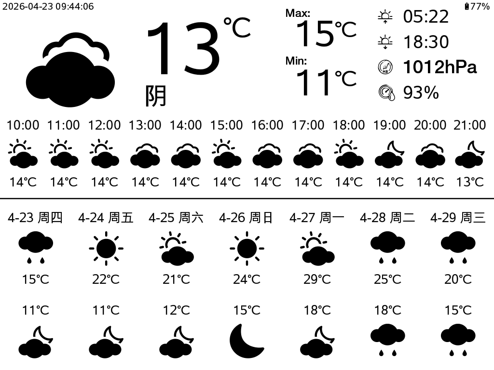

# Kindle Weatherstation

这是一个在 Kindle 本地运行的无服务器天气站方案，且针对电池续航进行了优化，单次充电约可持续运行一个月。

Kindle 每隔 60 分钟获取一次天气数据，基于预设的模板生成一份 SVG 文件，再将该 SVG 转换为 PNG 图片。屏幕刷新并显示新生成的 PNG 图像后，设备会随即进入休眠状态（挂起到内存）以节省电量，直到下一次更新。



## 项目文件说明

* `weather2svg.py`：查询天气数据，并根据模板组合生成 SVG 文件。
* `create-png.sh`：将 SVG 文件转换并压缩为 PNG 图片。
* `kindle-weather.sh`：主循环脚本。负责获取和显示数据，以及控制设备休眠与唤醒。
* `weather-preprocess.svg`：SVG 预设模板文件。
* `config.xml`：KUAL 插件配置文件。
* `menu.json`：KUAL 菜单配置文件。
* `sync2kindle.sh`：通过 rsync 将所有文件同步至 Kindle（主要在开发/调试期间提供便利）。
* `wifi.sh`：Wi-Fi 辅助脚本。
* `weatherstation.conf`：Upstart 启动配置脚本。

项目中已内置了所需的[rsvg-convert](https://github.com/ImageMagick/librsvg) 与 [pngcrush](https://pmt.sourceforge.io/pngcrush/) 二进制文件及相关依赖库。

## Kindle 准备工作

* 越狱 Kindle --> 可参考[Mobileread 论坛相关教程](https://www.mobileread.com/forums/showthread.php?t=320564)
* 安装 KUAL（插件管理器）
* 安装 USBNetwork 和 Python（通过 MRPI 安装）


## 安装步骤

* 在 `config.py` 中配置你所在的位置信息。
* 在 `wifi.sh` 中配置你的 Wi-Fi 名称 (SSID) 与密码。
* 在 Kindle 中创建目录 `/mnt/us/extensions/weatherstation`。
* 将本项目中的所有文件复制到刚才创建的目录中（或者直接使用 `sync2kindle.sh` 脚本进行同步）。

## 设置开机自启（Upstart 脚本）

（可选操作）你可以使用开机启动脚本，让天气站在 Kindle 启动时自动运行：

```bash
$ mntroot rw
$ cp /mnt/us/extensions/weatherstation/weatherstation.conf /etc/upstart
$ mntroot ro
$ start weatherstation
```

## 如何停止运行

* 按下 Kindle 的电源键唤醒设备后，快速通过 SSH 登录终端并执行 `killall kindle-weather.sh` 命令（如果你使用的是 Upstart 自启脚本，则执行 `stop weatherstation` 命令）。
* 或者按住电源键约 10 秒钟以强制重启 Kindle。

## 鸣谢
 * https://github.com/mattzzw/kindle-weatherstation
 * https://github.com/huanghui0906/API
 * https://icons.qweather.com/
